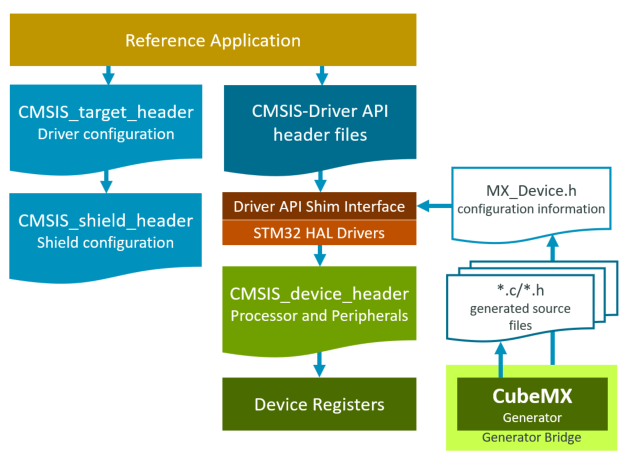

# CMSIS-Driver Interface to STM32 HAL

This is the development repository of the **CMSIS-Driver interface to STM32Cube HAL** (called Driver API Shim Interface below).

> **Note:** This is currently Work in Progress. Final release is expected in Q3'2024.

User applications and middleware components use [CMSIS-Driver](https://arm-software.github.io/CMSIS_6/latest/Driver/index.html) to achieve better code reuse and simplify integration in various ecosystems. CMSIS-Driver are generic and independent of a specific RTOS making it reusable across a wide range of supported microcontroller devices.

STM32 microcontrollers already provide powerful drivers, however with a different API interface, call STM32Cube HAL. With this **Driver API Shim Interface** the CMSIS standards can be used by the software ecosystem and application developers.

The diagram below outlines the software architecture that is used for example by [Reference Applications](https://github.com/Open-CMSIS-Pack/cmsis-toolbox/blob/main/docs/ReferenceApplications.md) and the [MDK middleware examples](https://github.com/ARM-software/MDK-Middleware/tree/main/Examples). Refer to the [CMSIS-Toolbox](https://github.com/Open-CMSIS-Pack/cmsis-toolbox/blob/main/docs/README.md) documentation [Reference Applications - Header File Structure](https://github.com/Open-CMSIS-Pack/cmsis-toolbox/blob/main/docs/ReferenceApplications.md#header-file-structure) for a description of the various components in this diagram. The Driver API Shim Interface is configured using [STM32CubeMX](https://www.st.com/en/development-tools/stm32cubemx.html) (CubeMX) that generates via the CMSIS tool integration the file `MX_Device.h`.



## Useful Links

- [Documentation](https://open-cmsis-pack.github.io/CMSIS-Driver_STM32/latest/index.html) - access to CMSIS-Driver Interface to STM32 HAL user's manual.
- [Raise Issues](https://github.com/Open-CMSIS-Pack/CMSIS-Driver_STM32/issues) - to provide feedback or report problems about the CMSIS-Driver Interface to STM32 HAL.
- [CMSIS-Driver](https://arm-software.github.io/CMSIS_6/latest/Driver/index.html) - access to CMSIS-Driver documentation.
- [MDK-Middleware](https://github.com/ARM-software/MDK-Middleware) - development repository of the MDK-Middleware that uses these drivers.

## Available CMSIS-Drivers

Driver API Shim Source     | Description
:--------------------------|:-----------
[ETH_MAC_STM32.c](https://github.com/Open-CMSIS-Pack/CMSIS-Driver_STM32/blob/main/Drivers/ETH_MAC_STM32.c) | [Ethernet MAC Interface](https://arm-software.github.io/CMSIS_6/latest/Driver/group__eth__mac__interface__gr.html); Can be combined with generic [Ethernet PHY Drivers](https://github.com/ARM-software/CMSIS-Driver/tree/main/Ethernet_PHY).
[GPIO_STM32.c](https://github.com/Open-CMSIS-Pack/CMSIS-Driver_STM32/blob/main/Drivers/GPIO_STM32.c) | [GPIO Interface](https://arm-software.github.io/CMSIS_6/latest/Driver/group__gpio__interface__gr.html); used for control lines (i.e. SPI) and [Virtual I/O interface](https://arm-software.github.io/CMSIS_6/latest/Driver/group__vio__interface__gr.html).
[I2C_STM32.c](https://github.com/Open-CMSIS-Pack/CMSIS-Driver_STM32/blob/main/Drivers/I2C_STM32.c) | [I2C Interface](https://arm-software.github.io/CMSIS_6/latest/Driver/group__i2c__interface__gr.html) that supports Master and Slave modes.
[SPI_STM32.c](https://github.com/Open-CMSIS-Pack/CMSIS-Driver_STM32/blob/main/Drivers/SPI_STM32.c) | [SPI Interface](https://arm-software.github.io/CMSIS_6/latest/Driver/group__spi__interface__gr.html) that supports Master and Slave modes.
[USART_STM32.c](https://github.com/Open-CMSIS-Pack/CMSIS-Driver_STM32/blob/main/Drivers/USART_STM32.c) | [USART Interface](https://arm-software.github.io/CMSIS_6/latest/Driver/group__usart__interface__gr.html) in asynchronous mode without control lines.
[USBD_STM32.c](https://github.com/Open-CMSIS-Pack/CMSIS-Driver_STM32/blob/main/Drivers/USBD_STM32.c) |  [USB Device Interface](https://arm-software.github.io/CMSIS_6/latest/Driver/group__usart__interface__gr.html) supports high-speed and and full-speed mode.

### Supported STM32 Device Families

- [STMicroelectronics STM32U5 Series](https://www.keil.arm.com/packs/stm32u0xx_dfp-keil)
- :
- :

### Driver Validation

The [Driver API Shim implementations](#available-cmsis-drivers) are validated using the [CMSIS-Driver_Validation](https://github.com/ARM-software/CMSIS-Driver_Validation) tests. Refer to the [Test Reports](https://github.com/Open-CMSIS-Pack/CMSIS-Driver_STM32/tree/main/Drivers/Validation) for details.

## Usage

Add the following packs and components to your project.

```yml
  packs:
    - pack: Keil::STM32U5xx_DFP@>=3.0.0       # choose the DFP that matches your device
    - pack: ARM::CMSIS@>=6.0.0
    - pack: ARM::CMSIS-Driver_STM32

  components:
    - component: CMSIS:CORE                   # CMSIS-Core component is required
    - component: Device:CubeMX                # Component that connects to CubeMX    
    - component: CMSIS Driver:USART           # Add Driver API shim interface
```

The drivers require configuration with [STM32CubeMX](https://www.st.com/en/development-tools/stm32cubemx.html). The configuration settings are exemplified in the [Driver API Shim Source](#available-cmsis-drivers), but depend on the actual device that is used.

For additional information refer to:

- [CMSIS-Toolbox - Configure STM32 Devices with CubeMX](https://github.com/Open-CMSIS-Pack/cmsis-toolbox/blob/main/docs/CubeMX.md) for usage information of STM32CubeMX with CMSIS projects. In µVision start CubeMX in dialog [Manage Run-Time Environment](https://developer.arm.com/documentation/101407/0540/Creating-Applications/Software-Components/Managing-Run-Time-Environment) from the component `Device:CubeMX`.

- [CMSIS-Driver - Theory of Operation](https://arm-software.github.io/CMSIS_6/latest/Driver/theoryOperation.html) describes the usage of CMSIS-Drivers in your application code via an [access struct](https://arm-software.github.io/CMSIS_6/latest/Driver/theoryOperation.html#AccessStruct). The driver instances available depend on the CubeMX device configuration as explained in the [Driver API Shim Source](#available-cmsis-drivers).

## Software Pack

The Driver API Shim Interface is released as [CMSIS software pack](https://www.keil.arm.com/packs/cmsis-driver_stm32-arm) and therefore accessible by CMSIS-Pack enabled software development tools. The pack is compatible with tools such as µVision 5.40 and the CMSIS-Toolbox.

### Using the development repository

This development repository can be used in a local directory and [mapped as software pack](https://github.com/Open-CMSIS-Pack/cmsis-toolbox/blob/main/docs/build-tools.md#install-a-repository) using for example `cpackget` with:

    cpackget add <path>/ARM.CMSIS-Driver_STM32.pdsc

### Generate software pack

The software pack is generated using bash shell scripts.

- `./gen_pack.sh` (provided via [Open-CMSIS-Pack/gen-pack](
https://github.com/Open-CMSIS-Pack/gen-pack)) generates the software pack. Run this script locally with:

      CMSIS-Driver_STM32 $ ./gen_pack.sh

- `./Documentation/Doxygen/gen_doc.sh` generates the HTML documentation from the input in the folder `/Documentation/Doxygen/`. Run this script locally with:

      CMSIS-Driver_STM32 $ ./Documentation/Doxygen/gen_doc.sh

### GitHub Actions

The repository uses GitHub Actions to generate the pack, publish documentation, and verify reference applications:

- `.github/workflows/pack.yml` based on [Open-CMSIS-Pack/gen-pack-action](https://github.com/Open-CMSIS-Pack/gen-pack-action) generates pack and documentation using the [Generate software pack](#generate-software-pack) scripts.

- `.github/workflows/gh-pages.yml` publishes the documentation to [open-cmsis-pack.github.io/CMSIS-Driver_STM32](https://open-cmsis-pack.github.io/CMSIS-Driver_STM32/latest/index.html).


## Repository top-level structure

Directory                   | Description
:---------------------------|:--------------
[.github/workflows](https://github.com/Open-CMSIS-Pack/CMSIS-Driver_STM32/tree/main/.github/workflows)  | [GitHub Actions](#github-actions).
[Documentation](https://github.com/Open-CMSIS-Pack/CMSIS-Driver_STM32/tree/main/Documentation)          | Doxygen source of the [documentation](https://open-cmsis-pack.github.io/CMSIS-Driver_STM32/latest/index.html).
[Drivers](https://github.com/Open-CMSIS-Pack/CMSIS-Driver_STM32/tree/main/Drivers)                | Source code of the Driver API Shim Interfaces.

## License

The CMSIS-Driver shim interfaces to STM32HAL are licensed under [](https://github.com/Open-CMSIS-Pack/CMSIS-Driver_STM32/blob/main/LICENSE).

## Contributions and Pull Requests

Contributions are accepted under [](https://github.com/Open-CMSIS-Pack/CMSIS-Driver_STM32/blob/main/LICENSE). Only submit contributions where you have authored all of the code.

### Issues and Labels

Please feel free to raise an [issue on GitHub](https://github.com/Open-CMSIS-Pack/CMSIS-Driver_STM32/issues)
to report misbehavior (i.e. bugs) or start discussions about enhancements. This
is your best way to interact directly with the maintenance team and the community.
We encourage you to append implementation suggestions as this helps to decrease the
workload of the very limited maintenance team.

We will be monitoring and responding to issues as best we can.
Please attempt to avoid filing duplicates of open or closed items when possible.
In the spirit of openness we will be tagging issues with the following:

- **bug** – We consider this issue to be a bug that will be investigated.
- **wontfix** - We appreciate this issue but decided not to change the current behavior.
- **enhancement** – Denotes something that will be implemented soon.
- **future** - Denotes something not yet schedule for implementation.
- **out-of-scope** - We consider this issue loosely related to CMSIS. It might by implemented outside of CMSIS. Let us know about your work.
- **question** – We have further questions to this issue. Please review and provide feedback.
- **documentation** - This issue is a documentation flaw that will be improved in future.